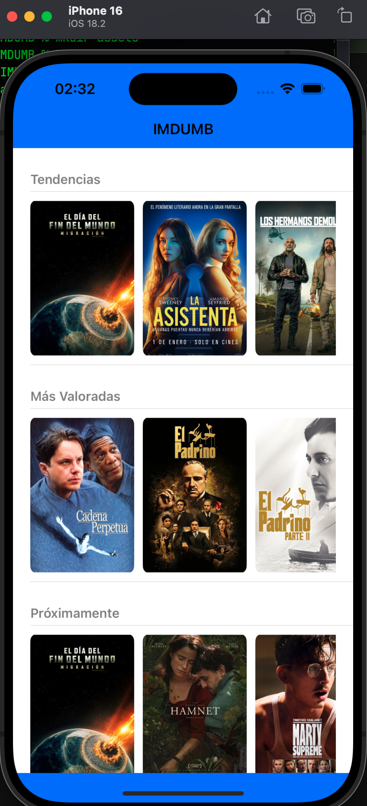
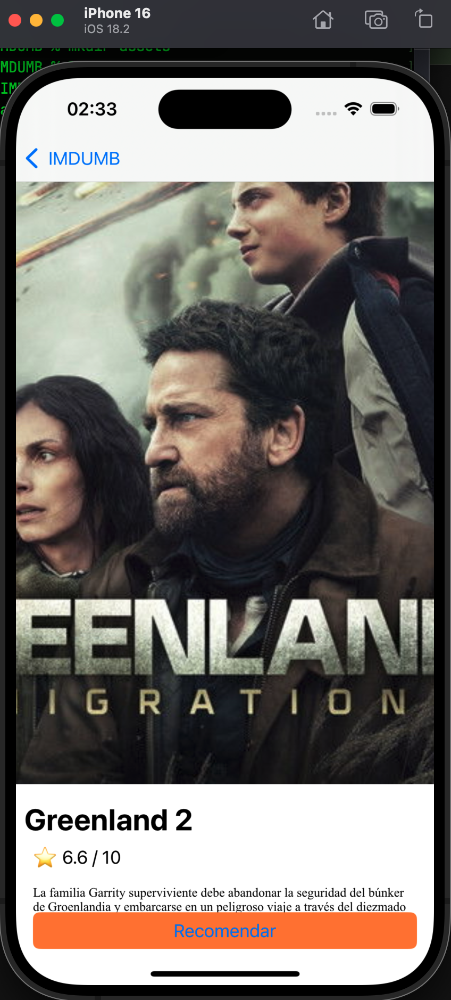
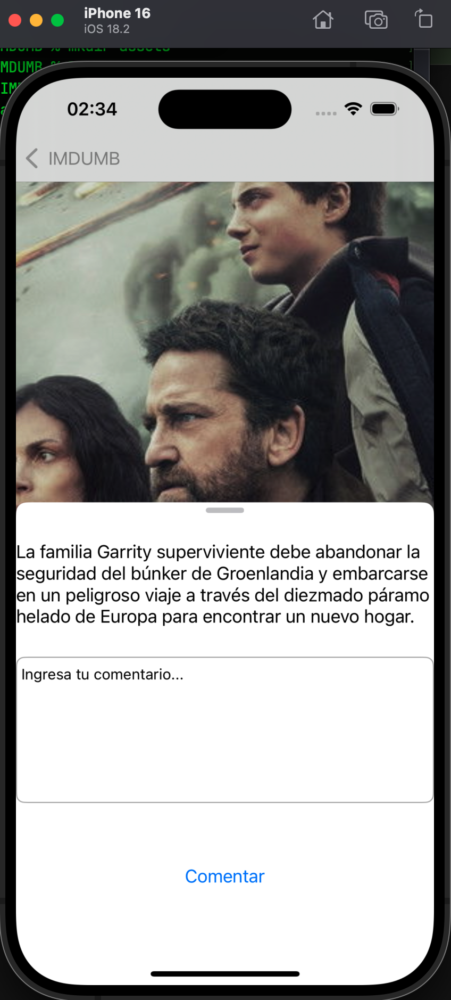

# IMDUMB - Movie Explorer 🎬

IMDUMB es una aplicación de iOS desarrollada como parte de un reto técnico, diseñada para explorar el catálogo de **The Movie Database (TMDB)**. El proyecto destaca por una interfaz fluida construida íntegramente mediante **archivos .xib** (sin Storyboards) y una arquitectura robusta orientada a la mantenibilidad.

## 🚀 Resumen del Proyecto
La aplicación permite visualizar tendencias y detalles de películas, cumpliendo con los siguientes requerimientos técnicos:

* **Carrusel de Imágenes**: Implementado en la pantalla de detalle con paginación horizontal nativa.
* **Renderizado HTML**: La descripción de las películas utiliza `NSAttributedString` para interpretar etiquetas HTML provenientes de la API.
* **Interacción Dinámica**: Botón "Recomendar" fijo en la parte inferior que despliega un modal ajustable al contenido.
* **Entrada de Usuario**: El modal incluye un `UITextView` con cierre de teclado mediante la tecla "Done" para dejar comentarios.
* **Feedback en Tiempo Real**: Uso de alertas nativas para confirmar el registro exitoso de recomendaciones.

## 🛠 Tech Stack & Dependencias
* **Lenguaje**: Swift 5.10+
* **Framework UI**: UIKit (100% .xib / Auto Layout por código y diseño visual).
* **Arquitectura**: VIPER / Clean Architecture.
* **Gestor de Dependencias**: Swift Package Manager (SPM).
* **Librerías Externas**:
  * `Kingfisher` (v7.0+): Utilizada para la descarga y caché eficiente de pósters y backdrops.

## ⚙️ Cómo Correr el Proyecto
El proyecto fue desarrollado y testeado en un entorno **Mac Mini M2**.

1. **Clonar el repositorio**:
   ```bash
   git clone https://github.com/leutamo/IMDUMB.git
   ```
2. **Abrir el proyecto**:
   Localiza y abre el archivo `IMDUMB.xcodeproj`.
3. **Instalación de dependencias**:
   Xcode descargará automáticamente el paquete de `Kingfisher` a través de SPM.
4. **Configuración**:
   * Asegúrate de contar con una conexión a internet estable.
   * La API Key de TMDB ya está integrada en las capas de red para facilitar la revisión rápida.
5. **Compilar**:
   Selecciona un simulador de iPhone (preferiblemente iPhone 15 o superior) y presiona `Cmd + R`.

## 🏗️ Documentación de SOLID
Se aplicaron principios de ingeniería de software para garantizar un código desacoplado y testeable. Puedes encontrar comentarios específicos sobre su implementación en:

* **Single Responsibility Principle (SRP)**: En `DetailPresenter.swift`, separando la lógica de negocio de la actualización de UI.
* **Dependency Inversion Principle (DIP)**: En `GetMovieImagesUseCase.swift`, donde el caso de uso depende de protocolos de repositorio y no de implementaciones concretas.
* **Interface Segregation Principle (ISP)**: En `DetailProtocols.swift`, mediante contratos granulares que evitan que la vista conozca métodos innecesarios del presentador.

## 📡 Endpoints Consumidos
Se interactuó con los siguientes recursos de TMDB API:

* `GET /movie/top_rated`: Listado de películas mejor calificadas.
* `GET /movie/upcoming`: Listado de próximos lanzamientos.
* `GET /movie/{movie_id}/images`: Obtención de imágenes para el carrusel de detalle.

## 🖼️ Capturas de Pantalla

### Pantalla de Inicio y Detalle con Carrusel


### Vista detalle


### Vista comentarios


---
Desarrollado con ❤️ para el proceso de selección técnica.

!Muchas gracias!

Giancarlos Hessel Araya Inca.
